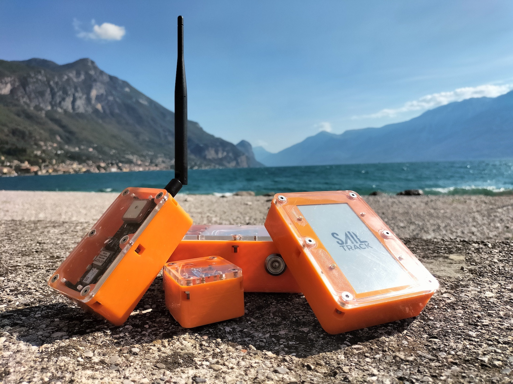

<p class="readme-header" align="center">
  
</p>

<h3 class="readme-header" align="center">Sailing Performance Tracker built by the Metis Sailing Team</h3>
<p class="readme-header" align="center">
  
  
</p>


## Overview
SailTrack is a performance tracker for sailing boats.
This system is built by the [Metis Sailing Team](http://metisvela.dii.unipd.it), a student project of the University of Padova that designs and builds high performance small sailing boats used in regattas against other universities.
The goal of the project is to collect data (e.g. wind speed, boat speed, boat direction,...) through several sensors placed in the boat in order to:

* Store them in a database for later analysis
* Show them to the crew through an onboard display
* Transmit them to the coach boat or to the ground station for real-time control and monitoring

The system is structured in modules, connected to each other via Wi-Fi, and communicating through a publish-subscribe messaging protocol, namely, [MQTT](https://mqtt.org).

<p align="center">
  
</p>

## Modules

The following are the modules that have been developed for the SailTrack system, follow the link to open the module's repository:

* [SailTrack Core](https://github.com/metisvela/sailtrack-core): Central module, it manages connections and gathers data.
* [SailTrack Radio](https://github.com/metisvela/sailtrack-radio): Module for getting GPS data and for transmitting data to the ground base station.
* [SailTrack IMU](https://github.com/metisvela/sailtrack-imu): Module for getting combined orientation and acceleration data of the boat.
* [SailTrack Monitor](https://github.com/metisvela/sailtrack-monitor): On board monitor for visualizing real time data for the crew.
* [SailTrack Strain](https://github.com/metisvela/sailtrack-strain): Module for measuring the forces acting on the boat maneuvers.
* [SailTrack Wind](https://github.com/metisvela/sailtrack-wind): Module for getting wind data, such as direction and intensity.
* [SailTrack Ground](https://github.com/metisvela/sailtrack-ground): Ground station for getting real-time data from the boat.



## Getting Started

To get started with the SailTrack system, you will need the SailTrack Core module and some other modules, depending on your application. For example, if you are interested in GPS data only, you will only need the SailTrack Core and SailTrack Radio modules. The SailTrack Core module is mandatory as it carries out the essential tasks for the system.

To build and assemble a module, refer to the `hardware` directory present in every module's repository. Inside it, you will the find the Bill Of Materials, the Connection Diagram and the STL files for the printable enclosure.

Once the module has been assembled, you can follow the installation process described in the `Installation` section of each module's repository, and finally the `Usage` section to learn how to use the module.

If you encounter any problem during the setup or the usage of the system, please open an issue on the specific module's repository.

## Data Collection Architecture

The following tools and protocols have been used in order to collect and monitor the measurements:

* [MQTT](https://mqtt.org): Messaging protocol used to communicate between modules over Wi-Fi using the publish-subscribe pattern. The lightness, speed and ease of use of the protocol determined its choice.
* [Telegraf](https://www.influxdata.com/time-series-platform/telegraf/): Tool used to collect metrics from different sources (e.g. MQTT messages) and store them in several possible ways (e.g. in a database). It's part of the InfluxData TICK Stack, therefore it's easily configurable to work with the InfluxDB database.
* [InfluxDB](https://www.influxdata.com/products/influxdb/): Time-series database used to store measurements, logs, computed and raw data. It's one of the leading platforms for time-series application, and it's highly optimized for this kind of use case.
* [Grafana](https://grafana.com): Modular visualization tool that can be connected to a variety of data sources (included InfluxDB) and generates graphs, maps, and plots. It is possible to build highly customized dashboards for every kind of application scenario.


## Messaging Architecture

Each module communicates with the others by using the MQTT Messaging Protocol, and in particular, the following MQTT Topic Scheme:

* `sensor` topic: It contains the raw readings coming from the sensors placed in the modules, each sensor is identified by its name. Example sub-topics: `sensor/gps0`, `sensor/imu0`, `sensor/strain0`, `sensor/strain1`,....
* `status` topic: It contains the status messages (containing battery voltage, cpu temperature, load indexes,...) coming from the modules, each one identified by its name. Example sub-topics: `status/core`, `status/imu`, `status/radio`,....
* `boat` topic: It contains the filtered and processed metrics regarding the boat (SOG, COG, Heading, Pitch, Roll,...).
* `wind` topic: It contains the filtered and processed metrics regarding the wind (TWA, TWD, TWS, AWD, AWS,...).

Every published message is formatted using [JSON](https://www.json.org/json-en.html). Example message published under the `sensor/gps0` topic:
```json
{
  "fixType": 3,
  "epoch": 1665442481,
  "lon": 118934393,
  "lat": 454111710,
  "gSpeed": 2335,
  "headMot": 34534256
}
```

## Sponsor

Many thanks to [LilyGo](https://www.lilygo.cc) for supporting the project with their products.


## Contributing

Contributors are welcome. If you are a student of the University of Padova, please apply for the Metis Sailing Team in the [website](http://metisvela.dii.unipd.it), specifying in the application form that you are interested in contributing to the SailTrack Project. If you are not a student of the University of Padova, feel free to open Pull Requests and Issues to contribute to the project.

You will find more detailed information on how to contribute to the project in the `Contributing` section of each module's repository.

## License

Copyright © 2023, [Metis Sailing Team](https://github.com/metisvela). SailTrack is available under the [GPL-3.0 license](https://www.gnu.org/licenses/gpl-3.0.en.html).
